# MyNarratives
## 1. Introdaction
A social network built on the PHP Laravel framework and MySQL, featuring user registration, login, account management, posting, commenting, liking, sharing photos, and music, as well as following other users. Admin functionalities include managing posts, photos, music, and user accounts. (Photo and music sharing features are still under development.)
## 2. Features
- **User Authentication:** Allows users to register and log in to their accounts securely.
- **Account Management:** Enables users to manage their account details, including profile information and password settings.
- **Posting:** Allows users to create and share posts with text content.
- **Commenting:** Provides users with the ability to comment on posts made by other users.
- **Liking:** Allows users to like posts made by other users.
- **Following Others:** Users can follow other users to stay updated with their posts and activities.
- **Admin Panel:** Includes functionalities for managing posts, photos, music tracks, and user accounts.
- **Sharing Photos:** Users can upload and share photos with their followers. (Feature currently under development)
- **Sharing Music:** Users can upload and share music tracks with their followers. (Feature currently under development)
## 3. Layouts
### Home pages in different log status(logedin / logedout)
<div style="display: flex; justify-content: center;">
    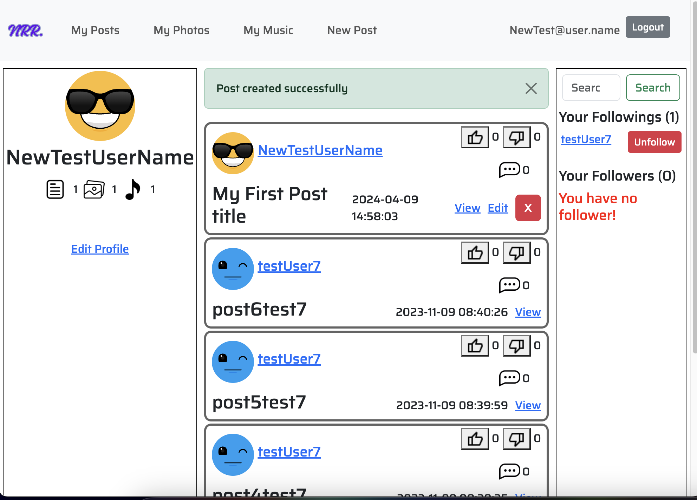
    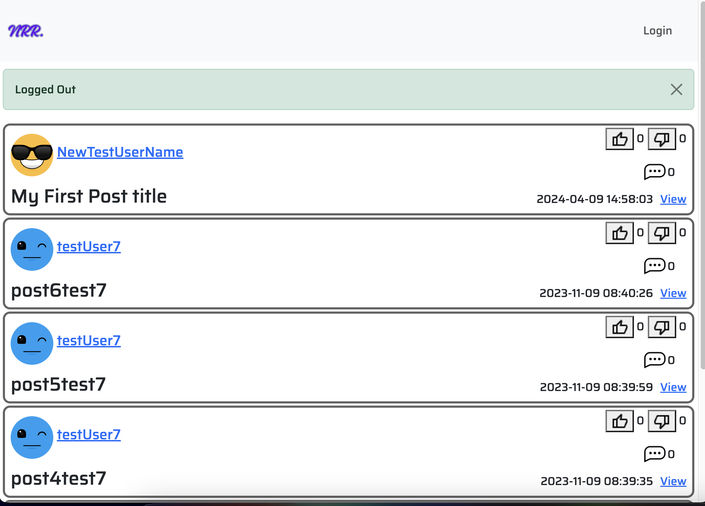
</div>

###  Login pages
<div style="display: flex; justify-content: center;">
    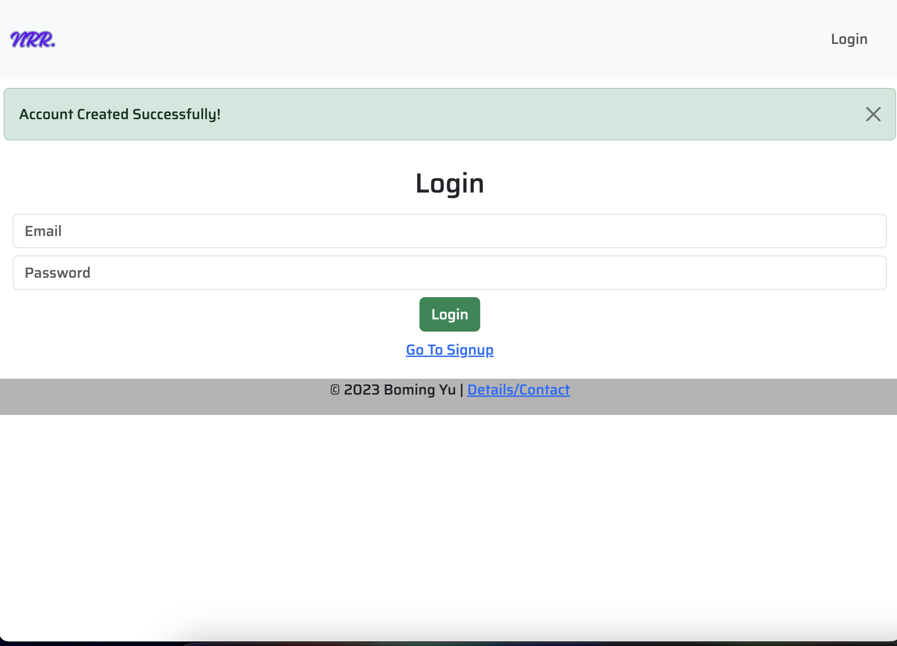
    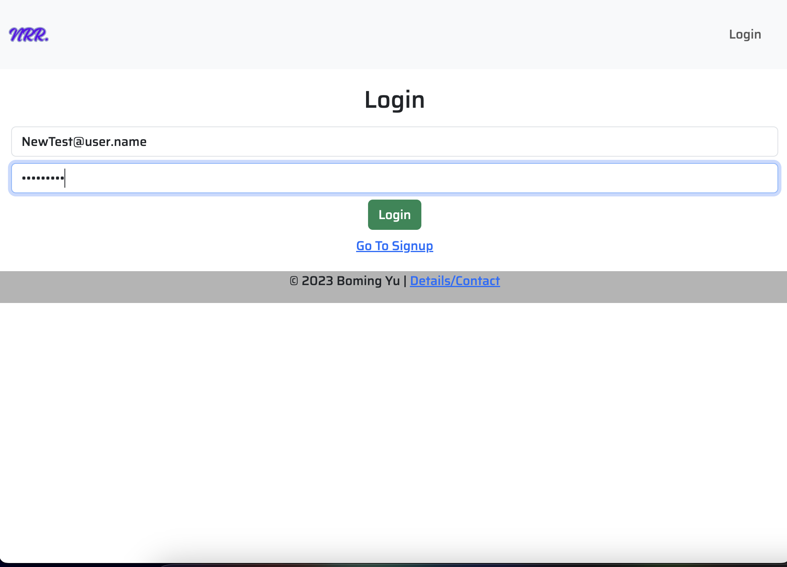
</div>

### Different user profile pages
<div style="display: flex; justify-content: center;">
    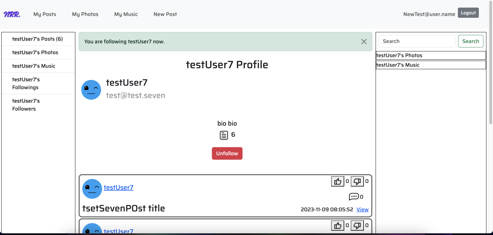
    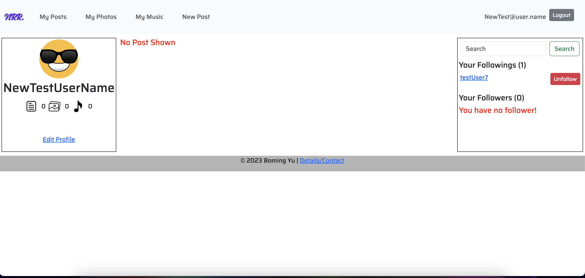
    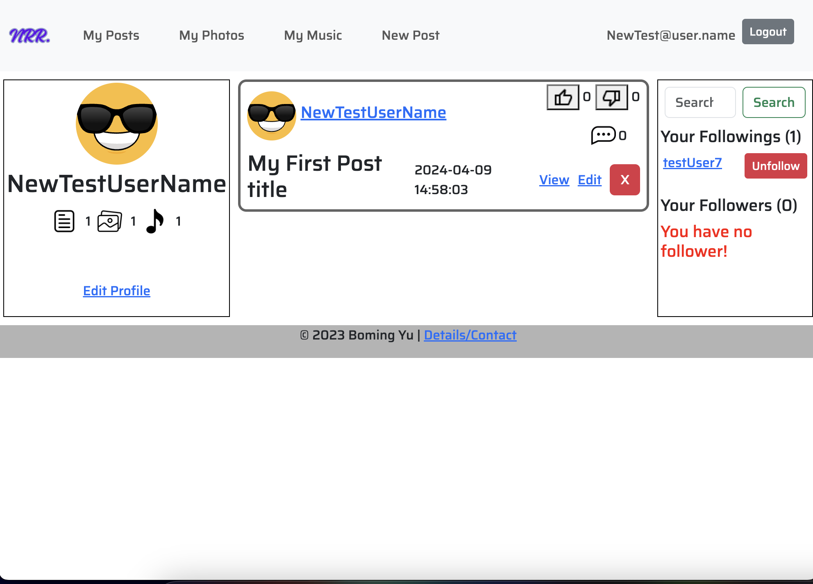
</div>

### Liking and following layouts
<div style="display: flex; justify-content: center;">
    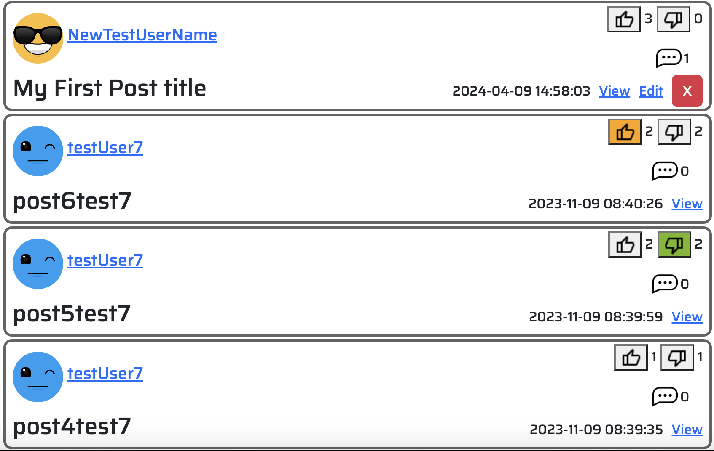
    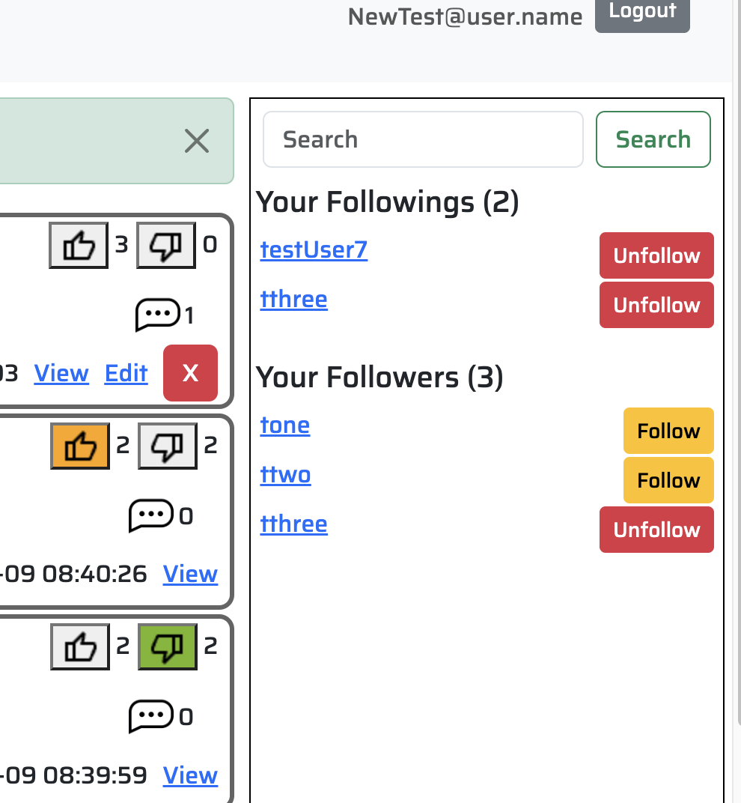
</div>

### Creating new post/comment and responsive example layouts
<div style="display: flex; justify-content: center;">
    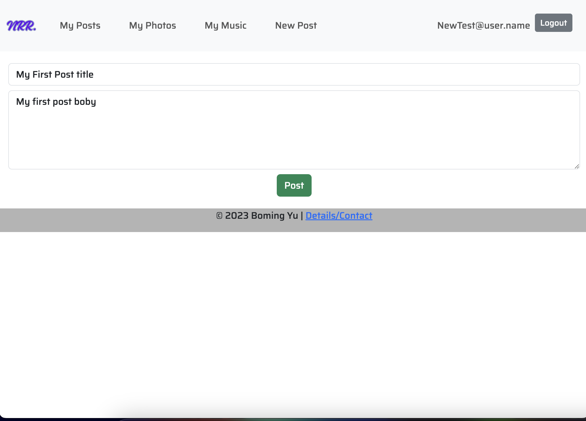
    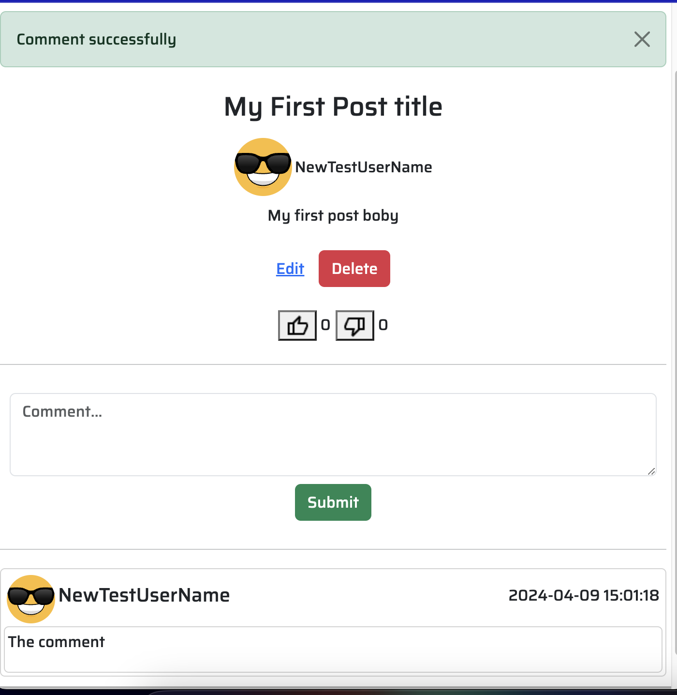
    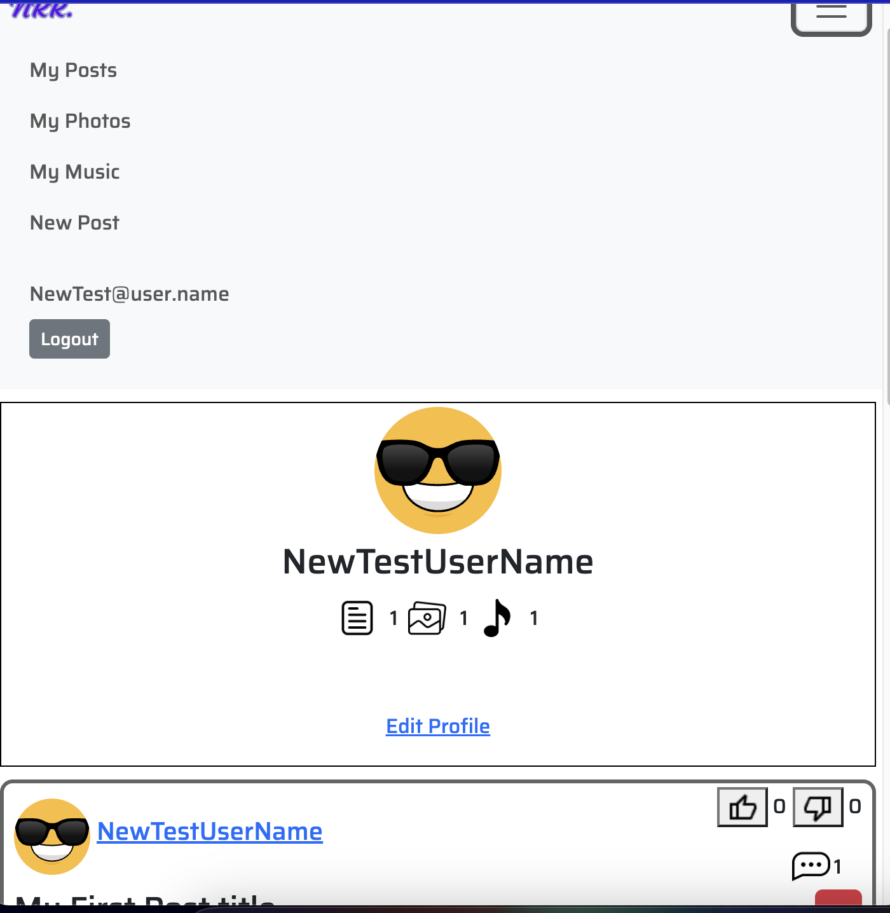
</div>

## 4. Technology
- Laravel PHP framework
- Bland.php for layout
- Bootstrap
- MySQL database

## 5. How To Use
```bash
# Clone The Project
git clone https://github.com/BomingYu/MyNarratives.git

# Enter The Project
cd MyNarratives

# Start The Application
php artisan serve
```